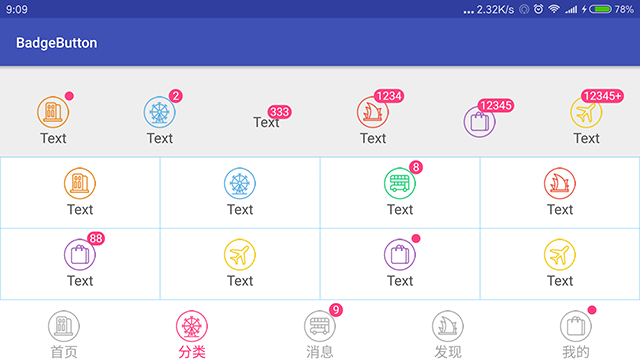

# BadgeButton [](https://jitpack.io/#czy1121/badgebutton)
 
带有徽标(数字，小红点)的按钮



## Gradle

``` groovy
repositories { 
    maven { url "https://jitpack.io" }
} 
dependencies {
    compile 'com.github.czy1121:badgebutton:1.1.0'
}
```
    
## Usage
    
**XML**

``` xml
<ezy.ui.view.BadgeButton
    style="@style/BadgeButton.GridItem"
    android:drawableTop="@mipmap/list_3"
    android:text="Text"
    app:btnBadgeText="8"
    app:btnBadgeVisible="true"/>
``` 

**属性**

``` xml 
<declare-styleable name="BadgeButton">
    <!-- 徽标文本，为空时显示一个小红点 -->
    <attr name="btnBadgeText" format="string"/>
    <!-- 徽标高度，宽度自适应 -->
    <attr name="btnBadgeHeight" format="dimension"/>
    <!-- 徽标背景色，文本白色 -->
    <attr name="btnBadgeColor" format="color"/>
    <!-- 徽标是否可见 -->
    <attr name="btnBadgeVisible" format="boolean"/>
</declare-styleable>
```
 

## License

```
Copyright 2016 czy1121

Licensed under the Apache License, Version 2.0 (the "License");
you may not use this file except in compliance with the License.
You may obtain a copy of the License at

   http://www.apache.org/licenses/LICENSE-2.0

Unless required by applicable law or agreed to in writing, software
distributed under the License is distributed on an "AS IS" BASIS,
WITHOUT WARRANTIES OR CONDITIONS OF ANY KIND, either express or implied.
See the License for the specific language governing permissions and
limitations under the License.
```